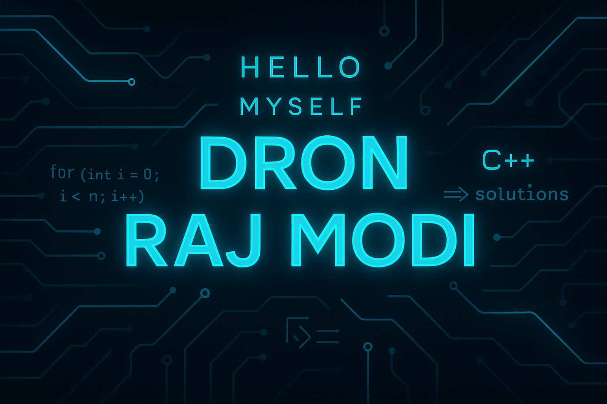

<!-- Profile Banner -->

  

<h1 align="center">💻 Hello, Myself Dron Raj Modi 🚀</h1>

  

---

### ⚡ About Me
- 🖥️ Passionate about **Algorithms, DSA, and AI**
- 💻 Skilled in **C++**, **Python**, **React**
- 🚀 Open Source Contributor
- 📚 Currently learning **Advanced Algorithms**

---

### 📊 GitHub Stats

  
  

---

### 🛠️ Tech Stack

  
  
  
  
  
  

---

### 🔗 Connect with Me

  
  
  

